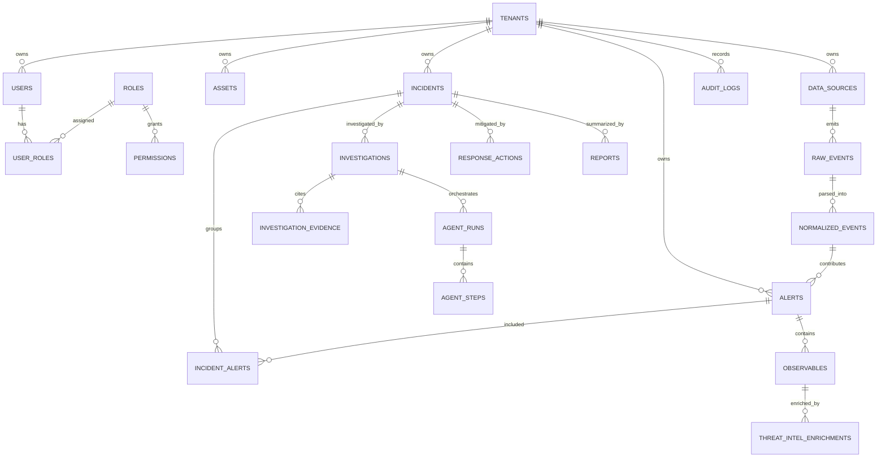

# Database Schema

Status: Draft 1
Primary database: PostgreSQL

## Design Rules

- UUID primary keys for externally visible resources.
- `tenant_id` on all tenant-scoped tables.
- Time partition high-volume event tables.
- Store raw vendor payloads in JSONB, but extract indexed fields used for query and correlation.
- Use immutable audit records for sensitive reads, writes, role changes, and response actions.

## Core Tables

| Table | Purpose |
| --- | --- |
| `tenants` | Organization boundary |
| `users` | Human identities |
| `roles` | Role definitions |
| `permissions` | Permission catalog |
| `user_roles` | Tenant-scoped role assignment |
| `api_keys` | Source-scoped ingestion credentials |
| `assets` | Hosts, users, cloud resources, containers, identities |
| `data_sources` | Log and alert source configuration |
| `raw_events` | Immutable incoming telemetry |
| `normalized_events` | Parsed common schema events |
| `alerts` | Deduplicated security alerts |
| `incidents` | Grouped alert investigations |
| `incident_alerts` | Incident-alert join table |
| `observables` | IPs, domains, URLs, hashes, users, files |
| `threat_intel_enrichments` | Reputation and enrichment history |
| `investigations` | Human/agent investigation sessions |
| `investigation_evidence` | Cited facts used in findings |
| `agent_runs` | LangGraph run metadata |
| `agent_steps` | Step-level state transitions |
| `response_actions` | Recommended or executed actions |
| `reports` | Executive, technical, RCA, compliance reports |
| `audit_logs` | Immutable audit trail |

## ER Diagram

## Initial Indexes

- `raw_events(tenant_id, occurred_at)`
- `normalized_events(tenant_id, occurred_at)`
- `alerts(tenant_id, status, severity, created_at)`
- `incidents(tenant_id, status, severity, updated_at)`
- `observables(tenant_id, type, value_hash)`
- `audit_logs(tenant_id, created_at, actor_user_id)`
- `agent_runs(tenant_id, incident_id, status, created_at)`
